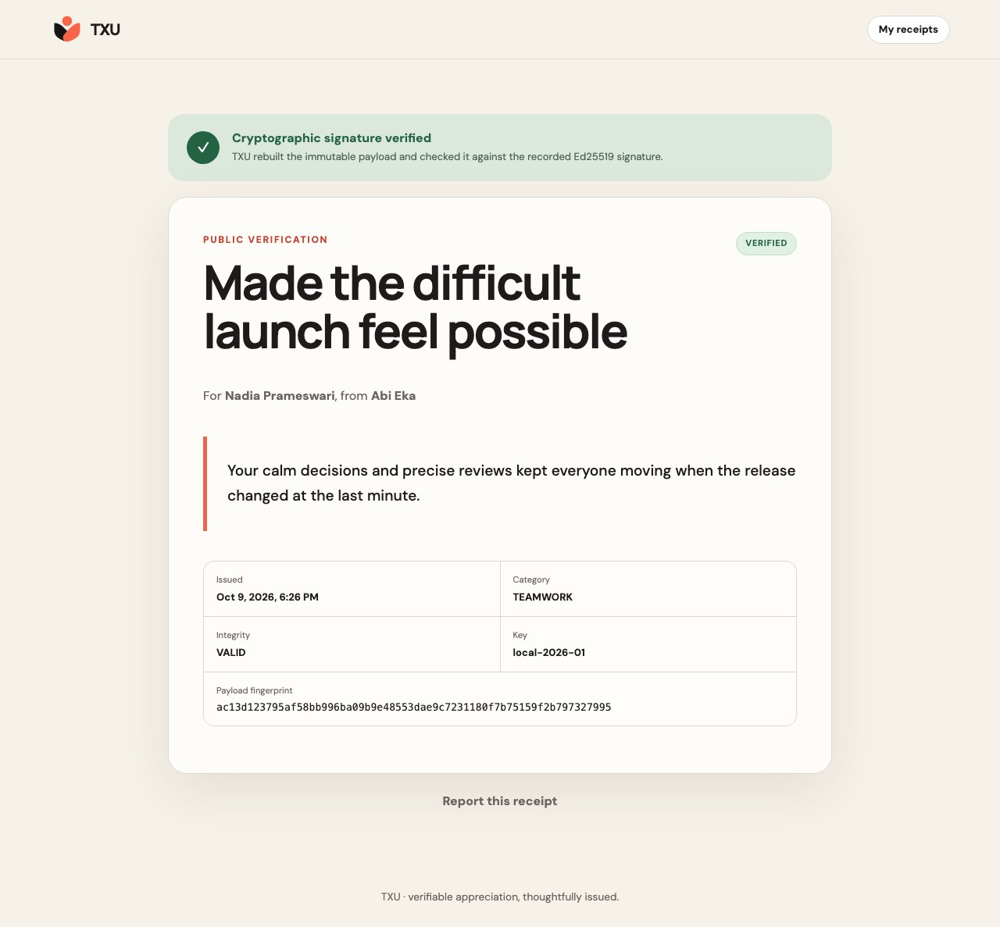
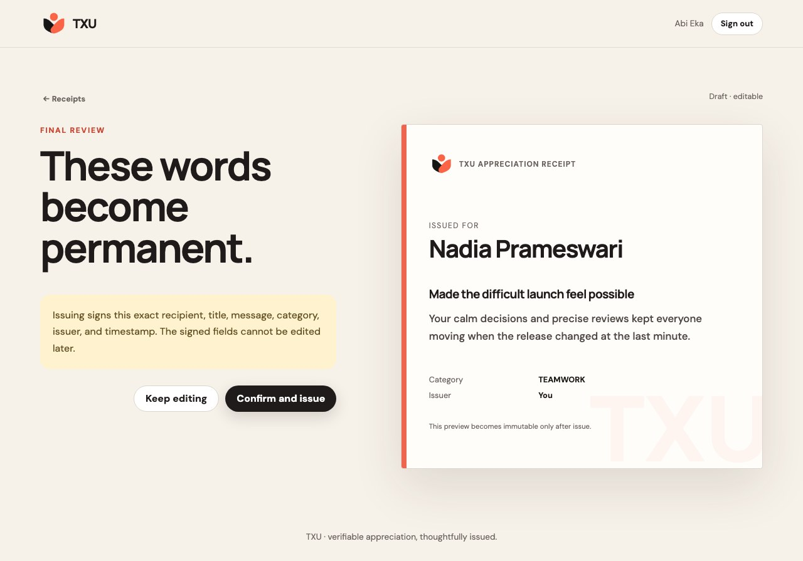
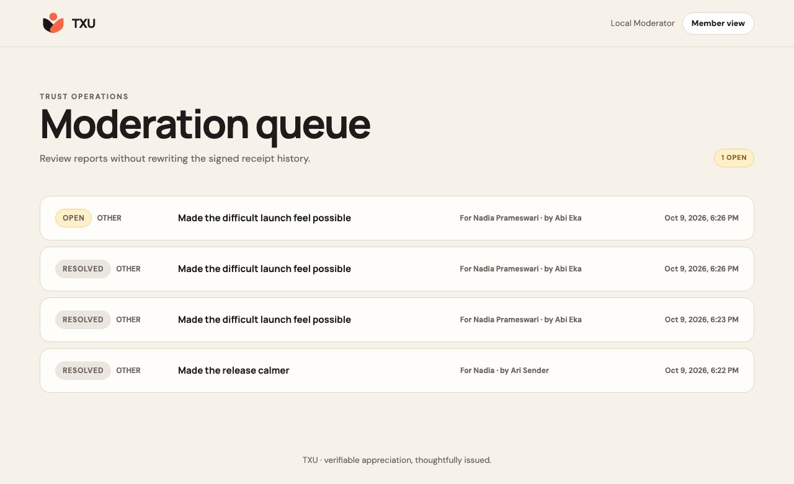
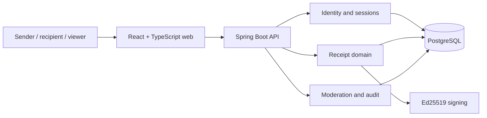

# TXU

[](https://github.com/abiekaputra/txu/actions/workflows/ci.yml)
[](https://github.com/abiekaputra/txu/actions/workflows/secret-scan.yml)
[](LICENSE)

**A thank-you can disappear in a timeline. TXU turns it into a receipt that can be verified.**

TXU (pronounced _thank you_) is a complete local web product for creating,
issuing, acknowledging, and independently verifying signed appreciation
receipts. It gives a human message a durable technical property: once issued,
the signed words cannot be silently rewritten.



## The product story

A useful contribution is often recognized in a chat message and then lost.
Screenshots preserve the words, but cannot prove whether a record is original.
TXU creates a deliberate boundary between an editable draft and an immutable
receipt. The sender previews every signed field, issues the record, and receives
two separate links:

- a public proof that anyone can verify; and
- a private, single-use link through which the recipient can acknowledge it.

Revocation and moderation change the receipt's operational state while
preserving its signed history. TXU does not claim legal identity verification,
notarization, or legally binding electronic signatures.

## What works

- Account registration, login, logout, secure server sessions, and CSRF protection
- Owned draft creation, editing, deletion, preview, and explicit issue confirmation
- Ed25519 signatures over deterministic canonical receipt payloads
- Public integrity verification and lifecycle status
- Private, single-use, account-free recipient acknowledgement
- Sender revocation with immutable signed content
- Anonymous abuse reports with duplicate and rate-limit protection
- Moderator queue with dismiss, hide, and restore decisions
- Append-only audit events for sensitive transitions
- PostgreSQL migrations, constraints, and an immutability trigger
- Health endpoints, correlation IDs, structured errors, and domain metrics
- Responsive React interface with intentional product states
- PostgreSQL integration and full browser journey tests

## Product evidence

| Draft and preview                             | Moderation without rewriting proof              |
| --------------------------------------------- | ----------------------------------------------- |
|  |  |

The Playwright journey creates the screenshots from a running product. It covers
registration, composition, issue, public verification, acknowledgement,
reporting, hide, restore, and mobile layout.

## Architecture



TXU uses a modular monolith because the identity, receipt, moderation, and audit
transactions belong to one focused product and benefit from one consistency
boundary. Domain modules are separated in code without the operational cost of
distributed services.

| Layer          | Technology                       | Reason                                             |
| -------------- | -------------------------------- | -------------------------------------------------- |
| Web            | React 19, TypeScript 6, Vite 8   | Typed, responsive product UI with a small runtime  |
| API            | Kotlin, Spring Boot 4, Java 21   | Explicit domain services and mature web security   |
| Persistence    | PostgreSQL 18, JDBC, Flyway      | Transactions, constraints, and repeatable schema   |
| Proof          | Ed25519, SHA-256, canonical JSON | Compact signatures and deterministic verification  |
| Sessions       | Spring Security, Spring Session  | Server-side login state and CSRF-protected browser |
| Quality        | JUnit, Vitest, Testing Library   | Focused domain and interface feedback              |
| Product checks | Playwright                       | Real browser validation and portfolio evidence     |
| Local runtime  | Docker Compose, Nginx            | One documented, reproducible startup path          |

Detailed decisions live in [the architecture documentation](docs/architecture/system-architecture.md).

## Run locally

### Requirements

- Docker with Compose v2
- OpenSSL

```bash
cp .env.example .env
./scripts/start-local.sh
```

Open [http://localhost:3001](http://localhost:3001). The startup script creates
local Ed25519 keys under the ignored `.secrets/` directory and then waits for
PostgreSQL, API, and web health checks.

The demo moderator account is available only under the local `demo` profile:

```text
email: moderator@txu.local
password: local-txu-moderator
```

Stop the product with `docker compose down`. Add `-v` only when you explicitly
want to discard the local database.

## Quality commands

```bash
pnpm install
pnpm quality
pnpm test:integration
pnpm test:e2e
```

Integration tests require PostgreSQL on port `5437`. Browser tests require the
API on `8080` and web application on `3001`; CI configures both automatically.
See [local development](docs/local-development.md) for a host-native workflow.

## Repository map

```text
backend/       Kotlin API, domain modules, migration, and tests
web/           React product interface and component tests
e2e/           Complete end-user browser journeys
docs/          Product, architecture, security, and engineering decisions
scripts/       Key generation, startup, and quality utilities
```

## Security boundaries

The public receipt identifier and private acknowledgement capability are
different high-entropy values. TXU stores only the acknowledgement token hash.
Issued content is protected in both the service and database. Passwords use an
adaptive encoder, browser mutations require CSRF, privileged endpoints enforce
roles on the server, and rate limits protect authentication, reporting, and
acknowledgement paths.

For limitations and responsible reporting, read [SECURITY.md](SECURITY.md).

## Project status

The local portfolio release is complete and validated end-to-end. Public cloud
deployment, real email delivery, legal identity claims, native mobile apps,
social feeds, attachments, and organization workspaces are outside this
release. These boundaries keep the implemented claim precise and reviewable.

## License

[MIT](LICENSE)
