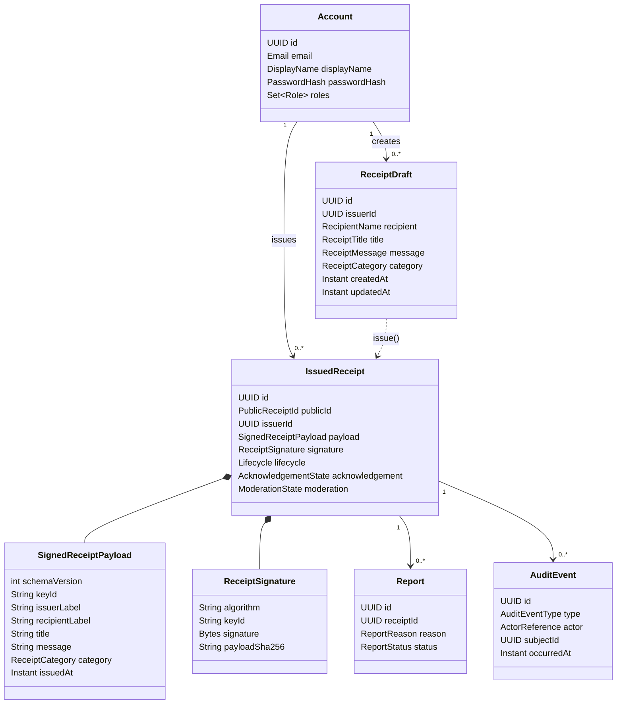
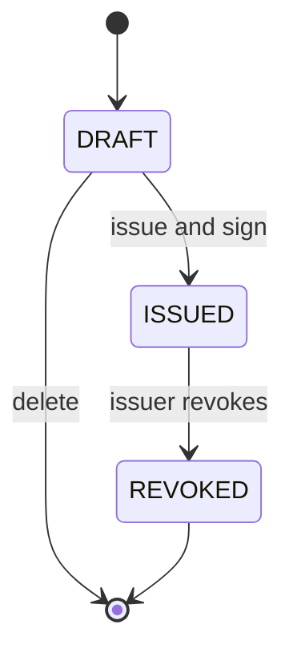
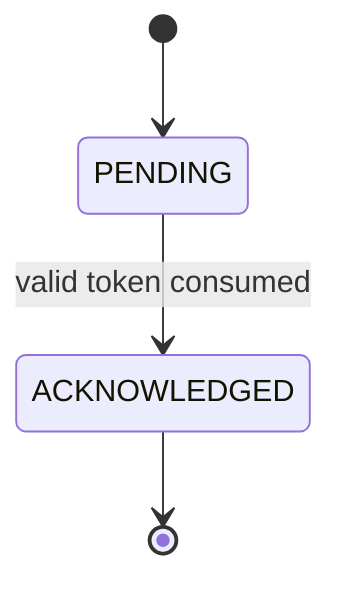
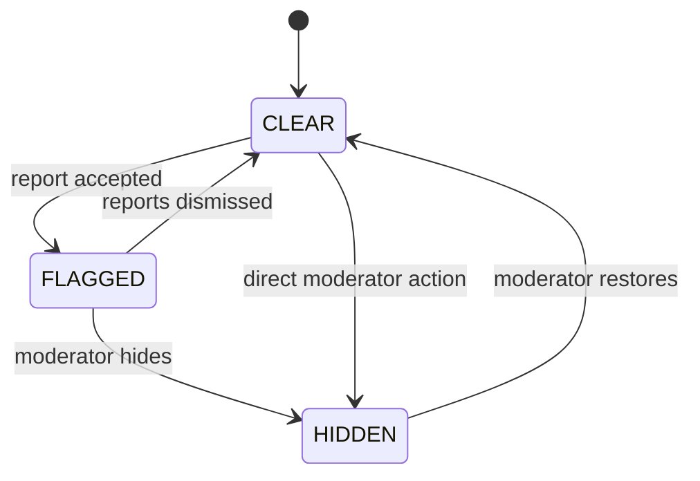

# Domain Model

## Why the state is split

A single status enum would combine unrelated facts and create invalid state
explosion. TXU stores three independent dimensions:

1. **Lifecycle** — may the receipt still be used?
2. **Acknowledgement** — did the recipient confirm it?
3. **Moderation visibility** — may its content be shown publicly?

The public verification result is a projection of all three plus cryptographic
integrity.

## Aggregate overview



## Lifecycle transitions

### Receipt lifecycle



- `DRAFT` is editable and deletable by its owner.
- `ISSUED` has an immutable signed snapshot.
- `REVOKED` is terminal and preserves that snapshot.

Draft and issued receipt may be represented as separate persistence records so
database constraints can prevent accidental post-issue edits.

### Acknowledgement



Acknowledgement can occur only while lifecycle is `ISSUED` and moderation is
not `HIDDEN`. An acknowledgement remains historically true if the receipt is
later revoked.

### Moderation



`FLAGGED` does not automatically hide content. It indicates pending review.

## Effective public result

Precedence prevents ambiguous UI:

1. Missing record → `NOT_FOUND`
2. Hidden moderation state → `HIDDEN`
3. Invalid signature → `INVALID`
4. Revoked lifecycle → `REVOKED`
5. Acknowledged → `VERIFIED_ACKNOWLEDGED`
6. Otherwise → `VERIFIED`

The API also returns the underlying dimensions so technical viewers can inspect
the decision.

## Signed payload

The canonical payload is a versioned UTF-8 byte sequence produced from fixed
field names and normalized values. The planned logical form is:

```json
{
  "schemaVersion": 1,
  "publicId": "high-entropy-public-id",
  "keyId": "local-2026-01",
  "issuerLabel": "Ari",
  "recipientLabel": "Maya",
  "title": "For keeping the release calm",
  "message": "You traced the failure, explained it clearly, and helped us ship.",
  "category": "TEAMWORK",
  "issuedAt": "2026-10-09T12:00:00.000Z"
}
```

Canonicalization rules:

- fixed field order defined by schema version;
- Unicode normalized to NFC before persistence and signing;
- timestamps stored as UTC with millisecond precision;
- no insignificant whitespace in serialized bytes;
- enum values serialized in uppercase ASCII;
- no nullable or unknown fields in schema version 1; and
- the exact bytes are hashed with SHA-256 and signed with Ed25519.

Golden test vectors must lock the expected bytes, hash, and signature behavior.

## Core invariants

1. Every issued receipt has exactly one immutable signed payload and signature.
2. A public ID is unique, random, and never used as an internal authorization
   decision by itself.
3. A draft and issued receipt always have one issuer account.
4. An acknowledgement exists at most once per receipt.
5. Acknowledgement secrets are stored only as a one-way hash.
6. A receipt has at most one revocation and revocation is irreversible.
7. Reports and moderation actions do not alter signed fields.
8. Privileged state changes and their audit events commit together.
9. A hidden receipt remains available only to authorized moderation review.

## Value objects

| Value object           | Responsibility                                                |
| ---------------------- | ------------------------------------------------------------- |
| `Email`                | Normalize and validate account identifiers                    |
| `DisplayName`          | Enforce safe human-readable issuer label                      |
| `RecipientName`        | Validate the recipient display label                          |
| `ReceiptTitle`         | Enforce concise title rules                                   |
| `ReceiptMessage`       | Normalize and enforce message limits                          |
| `PublicReceiptId`      | Generate and parse high-entropy URL identifiers               |
| `AcknowledgementToken` | Generate secret material and expose only its hash for storage |
| `SignedReceiptPayload` | Hold the complete immutable schema-versioned snapshot         |
| `ReceiptSignature`     | Hold algorithm, key ID, payload hash, and signature bytes     |

## Persistence constraints

- Unique normalized account email
- Unique receipt public ID
- Unique acknowledgement per receipt
- Unique revocation per receipt
- Foreign keys for every owned record
- Check constraints for valid enum and bounded lengths where practical
- Optimistic version or row lock on issue, acknowledge, revoke, and moderation
- Database role used by the application cannot update immutable signed columns
  after issue, reinforced by application policy and integration tests
