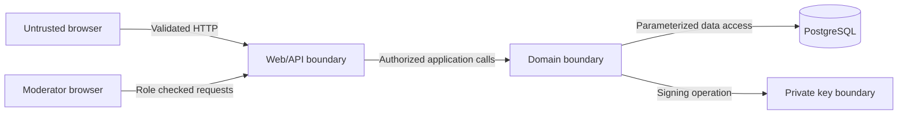

# Security Model

## Security objective

TXU must prevent silent changes to issued appreciation, unauthorized lifecycle
actions, exposure of recipient capability links, and untraceable privileged
decisions. The product does not verify a person's legal identity.

## Trust boundaries

- Browser input and browser state are untrusted.
- Public IDs provide location, not authorization.
- A recipient acknowledgement token is a bearer capability and must remain
  secret.
- The API process can request signatures; only the configured key provider may
  read private key material.
- Database content is verified before being presented as authentic.

## Assets

| Asset                        | Required protection                                    |
| ---------------------------- | ------------------------------------------------------ |
| Password hashes              | Confidentiality and resistance to offline guessing     |
| Session identifiers          | Confidentiality, integrity, rotation, and revocation   |
| Signing private key          | Strict confidentiality and startup validation          |
| Acknowledgement secret       | Confidentiality, one-time use, hash at rest            |
| Signed payload and signature | Integrity and durable retrieval                        |
| Moderation and audit history | Integrity and actor attribution                        |
| User-provided content        | Access control, output encoding, and bounded retention |

## Threats and controls

| Threat                      | Primary controls                                                | Verification evidence               |
| --------------------------- | --------------------------------------------------------------- | ----------------------------------- |
| Credential stuffing         | Adaptive password hash, generic errors, login rate limit        | Integration and rate-limit tests    |
| Session theft               | `HttpOnly`, `Secure`, `SameSite`, rotation, logout invalidation | Security configuration tests        |
| CSRF                        | Same-site cookie plus CSRF token on mutations                   | Negative API tests                  |
| Broken object authorization | Ownership and role policy in application layer                  | Cross-user integration tests        |
| XSS from receipt content    | Text rendering, CSP, no raw HTML, input bounds                  | Component and browser tests         |
| SQL injection               | Parameterized repositories and typed queries                    | Static review and adversarial tests |
| Receipt tampering           | Canonical payload hash and Ed25519 signature                    | Golden vectors and mutation tests   |
| Private link disclosure     | Separate UI, no logs, no referrer leakage, token hash           | Log assertions and browser tests    |
| Token replay                | Atomic consume and uniqueness constraint                        | Concurrent integration test         |
| Public ID enumeration       | 128-bit or greater random identifier, neutral errors            | ID generation and endpoint tests    |
| Report spam                 | Rate limit, duplicate suppression, bounded reason               | Rate-limit integration tests        |
| Moderator abuse             | Role checks, required reason, append-only audit                 | Authorization and audit tests       |
| Secret committed to Git     | Example values, secret scanner, documented generation           | CI secret scan                      |
| Dependency compromise       | Lockfiles, update policy, dependency scanning                   | CI report                           |

## Authentication and sessions

- Normalize email before uniqueness lookup.
- Hash passwords with the Spring Security recommended adaptive encoder selected
  in Phase 2; never implement password cryptography directly.
- Use a server-side session. Do not store bearer tokens in local storage.
- Rotate the session identifier on authentication and privilege changes.
- Invalidate it on logout and after configured inactivity and absolute limits.
- Return generic authentication failures and never log raw credentials.
- Seed development users only in the explicit demo profile with non-production
  credentials documented as disposable.

## Authorization policy

| Action                            | Public | Member |     Receipt owner | Moderator | Admin |
| --------------------------------- | -----: | -----: | ----------------: | --------: | ----: |
| Verify visible receipt            |    Yes |    Yes |               Yes |       Yes |   Yes |
| Submit report                     |    Yes |    Yes |               Yes |       Yes |   Yes |
| Manage own draft                  |     No |     No |               Yes |        No |   Yes |
| Issue or revoke own receipt       |     No |     No |               Yes |        No |   Yes |
| Acknowledge with valid capability |  Token |  Token |             Token |     Token | Token |
| Review hidden content             |     No |     No | Own metadata only |       Yes |   Yes |
| Decide moderation report          |     No |     No |                No |       Yes |   Yes |
| Read audit trail                  |     No |     No |                No |    Scoped |   Yes |

The table is implemented on the server. UI visibility only improves usability.

## Signature and key handling

- Algorithm: Ed25519 through a maintained JVM provider.
- The active private key is supplied through environment or a mounted local
  secret file, never committed or stored in PostgreSQL.
- Each signature records a stable key identifier.
- Verification uses configured public keys indexed by key identifier.
- Startup readiness fails if the active key is missing or malformed.
- Logs include the key identifier and outcome, never key bytes.
- Historical public keys remain available when a future rotation occurs.
- Phase 2 provides a safe local key-generation command and ignored secret path.

## Acknowledgement capability

- Generate at least 256 bits of cryptographically secure random token material.
- Encode with URL-safe base64 without padding.
- Persist only a keyed hash or slow secret hash chosen in Phase 2.
- Compare hashes in constant time where the library supports it.
- Display the plaintext secret only in the issue response.
- Never place the secret in analytics, logs, screenshots, page titles, or
  outbound referrer headers.
- Consume the token and create the acknowledgement in one transaction.

## Browser protections

- Same-origin API in the reference runtime
- CSRF protection on state-changing browser requests
- Restrictive Content Security Policy without unsafe inline scripts
- `frame-ancestors 'none'`
- `X-Content-Type-Options: nosniff`
- conservative `Referrer-Policy`, especially on acknowledgement routes
- explicit permitted HTTP methods and media types
- user content rendered as text, never unsanitized HTML
- accessible confirmation for irreversible actions

## Privacy and retention

- P0 stores only account identity, receipt content, operational state, reports,
  and audit metadata needed for the product.
- Public pages expose the issuer display label selected for the receipt, not the
  account email.
- Anonymous report abuse prevention stores a coarse, salted fingerprint with a
  short retention period; raw IP addresses are not retained in the report.
- Signed records are retained after revocation because deletion would undermine
  the stated integrity model. This behavior is disclosed before issue.
- Development fixtures contain fictional data only.

## Incident-safe behavior

- Missing signing key: readiness fails and issuing is disabled; drafts remain
  usable.
- Verification failure: show `INVALID`, emit a security event, and retain the
  record for investigation.
- Database failure: return a retryable error with correlation ID; never claim a
  state transition succeeded.
- Suspected acknowledgement-token leak: P0 supports revoking the receipt; token
  rotation is P1.

## Security validation gate

Before portfolio completion, TXU requires:

1. automated cross-account authorization tests;
2. signature golden vectors and tamper cases;
3. concurrent acknowledgement and revocation tests;
4. CSRF, session, output encoding, and security-header checks;
5. secret and dependency scans in CI; and
6. a manual review confirming documentation matches actual controls.
