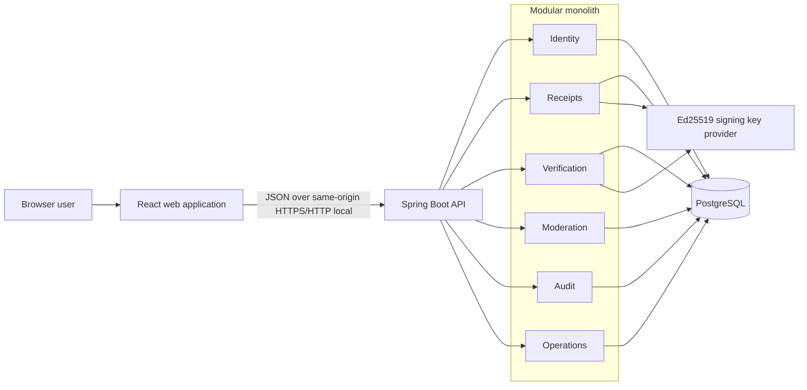
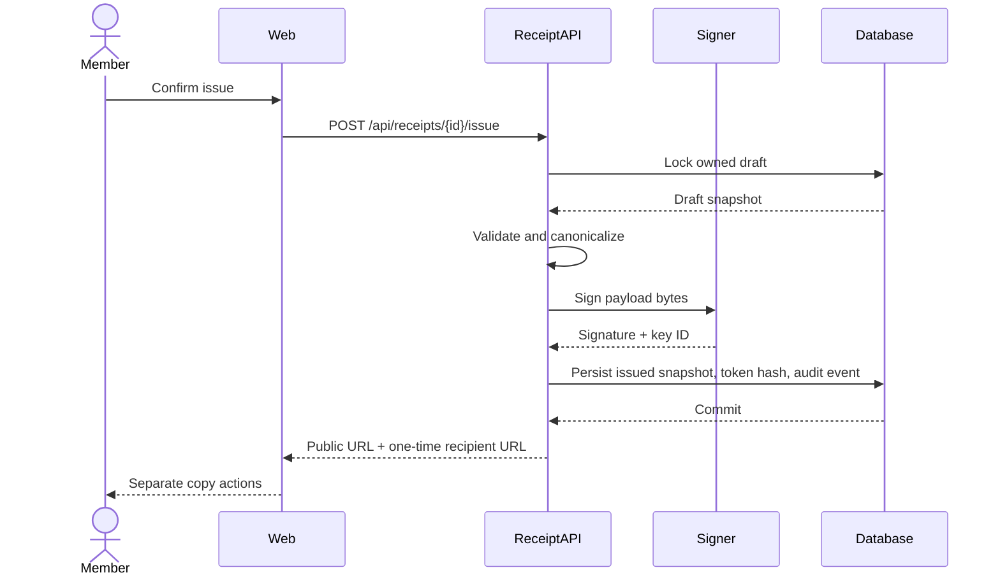

# System Architecture

## Architecture style

TXU uses a **modular monolith**. The product is intentionally too small to gain
from distributed services, but its domain boundaries remain explicit so each
module owns one reason to change.



## Technology direction

| Layer          | Choice                     | Reason                                                                           |
| -------------- | -------------------------- | -------------------------------------------------------------------------------- |
| Backend        | Kotlin + Spring Boot       | Strong domain types, mature security, validation, data, and test ecosystem       |
| Frontend       | React + TypeScript + Vite  | Fast browser product workflow with typed UI contracts                            |
| Database       | PostgreSQL                 | Transactions, constraints, indexing, and production-relevant relational behavior |
| Migrations     | Flyway                     | Versioned schema changes tied to application delivery                            |
| Signature      | Ed25519                    | Small keys and signatures with a modern, deterministic signing API               |
| API            | REST + OpenAPI             | Direct fit for resource and state-transition workflows                           |
| Session        | Server-side session cookie | Browser-first security without exposing bearer tokens to JavaScript storage      |
| Backend tests  | JUnit 5 + Testcontainers   | Domain tests plus real PostgreSQL integration behavior                           |
| Frontend tests | Vitest + Testing Library   | Fast component and behavior verification                                         |
| Browser tests  | Playwright                 | Cross-layer proof of complete user journeys                                      |
| Runtime        | Docker Compose             | Reproducible local product without requiring public deployment                   |

Dependency versions are a Phase 2 decision and must be checked for current
support and compatibility before they are locked.

## Backend modules

### Identity

Owns account registration, password authentication, sessions, roles, and the
authenticated actor context. It does not own receipt permissions; receipt
policies consume the actor context.

### Receipts

Owns draft content, validation, issue orchestration, acknowledgement, revocation,
and lifecycle policies. The issue use case calls the signing port but does not
know how private key material is loaded.

### Verification

Owns canonical payload reconstruction, signature verification, and the public
verification projection. It translates technical integrity and current product
state into one safe response.

### Moderation

Owns reports, report decisions, visibility state, and moderator policy. It can
change whether content is displayed but cannot mutate or delete the signed
snapshot.

### Audit

Owns append-only security event persistence and retrieval for authorized
operators. Domain use cases append typed events inside the same transaction as
their mutation.

### Operations

Owns health, readiness, metrics, correlation IDs, and safe error envelopes. It
contains no product business rules.

## Frontend feature boundaries

```text
web/src/
├── app/                 # composition, routing, providers
├── features/
│   ├── auth/            # register, sign in, session recovery
│   ├── dashboard/       # member receipt summaries
│   ├── composer/        # draft form and validation presentation
│   ├── receipt/         # preview and member detail
│   ├── verification/    # public verification result
│   ├── acknowledgement/ # private recipient confirmation
│   └── moderation/      # reports and decisions
├── shared/
│   ├── api/             # generated or typed transport client
│   ├── components/      # reusable accessible primitives
│   └── utilities/       # narrow framework-independent helpers
└── test/                # shared test setup only
```

Features may depend on `shared`; they must not import another feature's private
implementation. Shared components stay presentation-focused and contain no TXU
domain transitions.

## Main issue transaction



Any failure before commit leaves the receipt in `DRAFT`. The response returns
the plaintext acknowledgement secret only after a successful commit.

## API surface

The exact OpenAPI document is created in Phase 2. The planned resources are:

| Method and path                                | Access           | Purpose                                |
| ---------------------------------------------- | ---------------- | -------------------------------------- |
| `POST /api/auth/register`                      | Public           | Create a member account and session    |
| `POST /api/auth/login`                         | Public           | Authenticate and create a session      |
| `POST /api/auth/logout`                        | Authenticated    | End current session                    |
| `GET /api/session`                             | Public           | Return safe current-session projection |
| `GET /api/receipts`                            | Member           | List own drafts and receipts           |
| `POST /api/receipts`                           | Member           | Create a draft                         |
| `GET /api/receipts/{id}`                       | Owner            | Read own draft or receipt              |
| `PATCH /api/receipts/{id}`                     | Owner            | Update a draft                         |
| `DELETE /api/receipts/{id}`                    | Owner            | Delete a draft                         |
| `POST /api/receipts/{id}/issue`                | Owner            | Issue and sign a draft                 |
| `POST /api/receipts/{id}/revoke`               | Issuer           | Revoke an issued receipt               |
| `GET /api/public/receipts/{publicId}`          | Public           | Verify visible receipt                 |
| `GET /api/acknowledgements/{token}`            | Token            | Preview recipient action               |
| `POST /api/acknowledgements/{token}`           | Token            | Acknowledge once                       |
| `POST /api/public/receipts/{publicId}/reports` | Public           | Report content                         |
| `GET /api/moderation/reports`                  | Moderator        | Review queue                           |
| `POST /api/moderation/reports/{id}/decision`   | Moderator        | Dismiss, hide, or restore              |
| `GET /actuator/health/liveness`                | Local operations | Process health                         |
| `GET /actuator/health/readiness`               | Local operations | Dependency readiness                   |

## Data ownership and transaction boundaries

- Identity owns `accounts`, `roles`, and sessions.
- Receipts owns `receipt_drafts`, `receipts`, `acknowledgements`, and
  `revocations`.
- Moderation owns `reports` and `moderation_actions`.
- Audit owns `audit_events` and permits inserts only through its append port.
- Issue, acknowledgement, revocation, and moderation decisions each commit their
  state change and audit event in one database transaction.

Cross-module reads use application ports or purpose-built projections. Modules
do not update another module's tables directly.

## Local runtime

The reference Compose topology will contain:

1. `web` — static frontend served behind the local application origin;
2. `api` — Spring Boot service;
3. `postgres` — persistent local database; and
4. an optional test-only browser runner profile.

No queue, cache, SMTP server, or cloud dependency is required for P0.

## Observability

- JSON logs with timestamp, level, correlation ID, route, outcome, and duration
- No receipt message, credential, token, cookie, or signing key in logs
- Micrometer counters for issue and verification outcomes
- HTTP latency histogram by route template and status family
- Liveness and readiness probes
- Stable error code with safe user message and correlation ID
