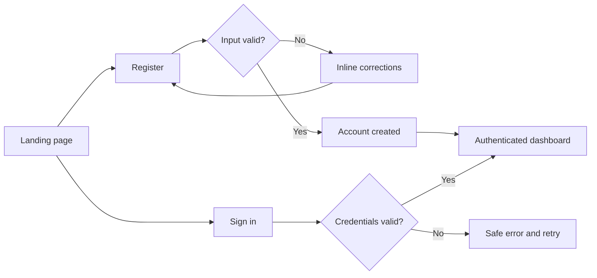
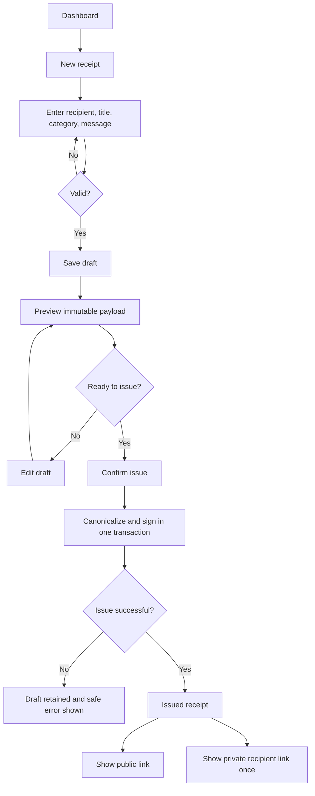
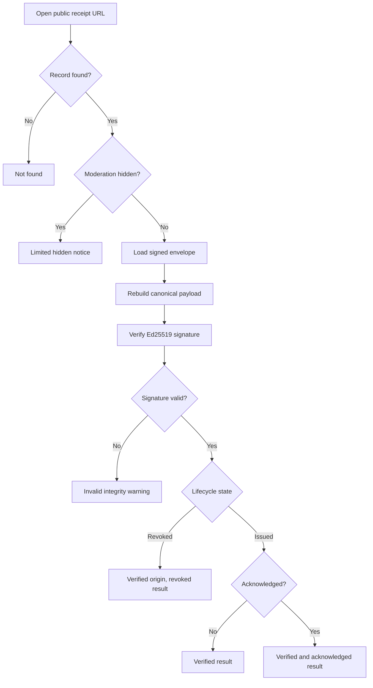
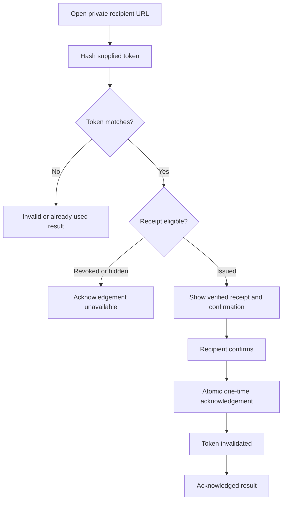
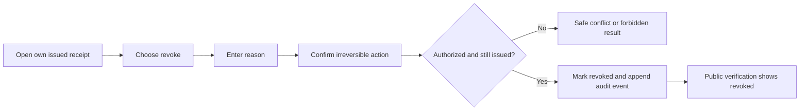
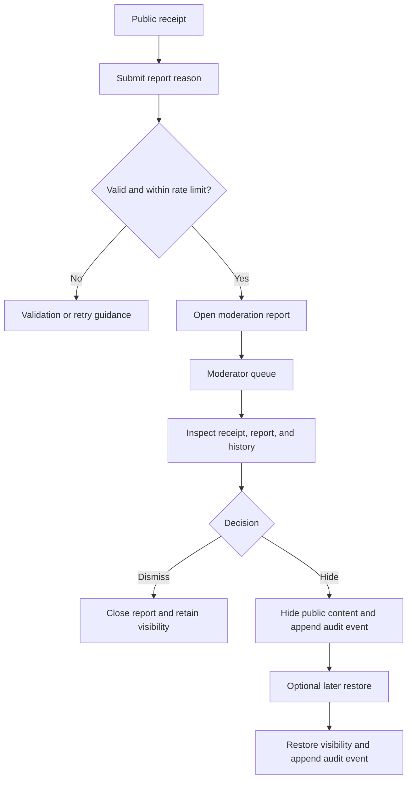

# User Flows

## 1. Register and sign in

The server creates a secure browser session after successful authentication. A
generic credential error avoids revealing whether an account exists.

## 2. Create, preview, and issue a receipt

The issue boundary is deliberate. Draft edits remain reversible. After issue,
the signed fields become immutable and the acknowledgement secret is never
stored in plaintext.

## 3. Public verification

Verification separates two questions:

1. Does the signature match the immutable issued payload?
2. Is the receipt currently usable according to lifecycle and moderation state?

A revoked receipt may retain a valid historical signature while its effective
result is `REVOKED`.

## 4. Recipient acknowledgement

The endpoint is idempotent at the business level: a replay cannot create a
second acknowledgement or recover the secret.

## 5. Sender revocation

Revocation is terminal. TXU retains the signed snapshot, acknowledgement event,
revocation reason, actor, and timestamp.

## 6. Report and moderation

Anonymous reporting stores a coarse abuse-prevention fingerprint rather than a
raw IP address. It is never part of the signed receipt.

## 7. Failure and recovery

| Failure                   | User-facing behavior                       | Data guarantee                      |
| ------------------------- | ------------------------------------------ | ----------------------------------- |
| Validation rejected       | Field-level guidance; form values retained | No invalid mutation                 |
| Session expired           | Sign-in prompt and safe return path        | No unauthorized mutation            |
| Database unavailable      | Retryable service message                  | No partial issue or acknowledgement |
| Signing key unavailable   | Issue blocked; draft retained              | No unsigned issued receipt          |
| Duplicate acknowledgement | Already used result                        | One acknowledgement event           |
| Concurrent revocation     | Current state returned                     | Terminal transition occurs once     |
| Unknown public ID         | Neutral not-found page                     | No identifier enumeration detail    |
| Invalid signature         | Prominent integrity warning                | Record preserved for investigation  |
